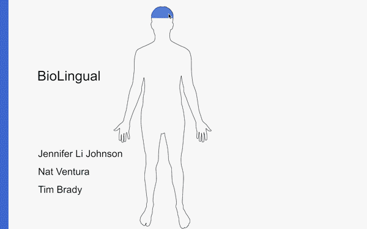
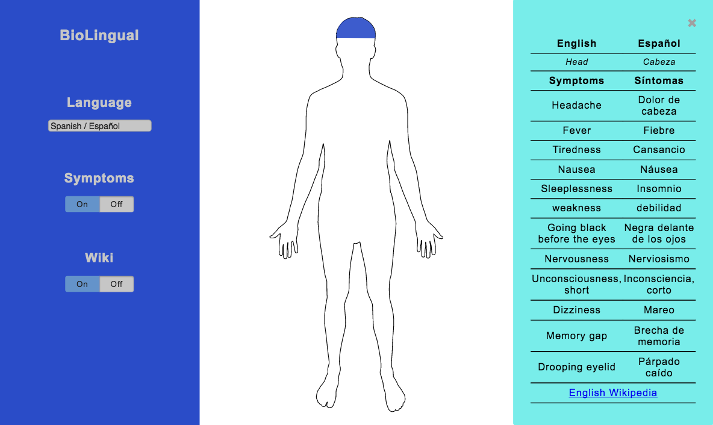

# BioLingual

[](https://vimeo.com/229168815)

BioLingual is an interactive anatomy map that translates the names of body parts and commonly associated symptoms using ApiMedic and the Google Translate API.

While we currently cannot host the full featured version of BioLingual due to limited free queries to ApiMedic and the Google Translate API, we have created a demo site with translations in Spanish, Mandarin, and French.

[<b>Demo Site</b>](http://biolingual.online/)

Users can click or tap an area of the body on our main body display in order to read a translation of that body part in another language of their choice. We believe a future version of BioLingual could help facilitate communication between patients and healthcare providers who do not speak the same language.

## Authors

* **Jennifer Li Johnson** - [jenlij](https://github.com/jenlij)
* **Tim Brady** - [tfb414](https://github.com/tfb414)
* **Nat Ventura** - [nat-ventura](https://github.com/nat-ventura)

## Built With

* JavaScript ES5
* jQuery 3.2.1
* HTML5/CSS3
* Adobe Illustrator CC
* Inkscape
* [ApiMedic](https://apimedic.net/) - Medical Symptom Checker API
* [Google Translate](https://cloud.google.com/translate/) - Google Cloud Platform Translation API

## Development Process
* [1. Concept](#1-concept)
* [2. Initial Planning](#2-initial-planning)
* [3. Visualization and Accessing APIs](#3-visualization-and-accessing-apis)
* [4. Challenges and Successes!](#4-challenges-and-successes)
* [5. Future Additions](#5-future-additions)

### 1. Concept

Our idea began with the idea of an interactive "body map," where a user would be able to tap a part of the body, and trigger a display of that body part's name and description. While brainstorming the type of body part information to provide, we decided that providing a translation and commonly associated illnesses could potentially provide a useful interface for both healthcare providers and patients to better communicate.

### 2. Initial Planning

Early on, we planned to use the musculoskeletal or circulatory system as the "theme" for our anatomy map, and then create labels for major organs in those body systems. However, since we wanted to work with an accredited symptom-checking API, we soon realized that it would be more efficient to limit our "selectable" body parts to the topical headings provided by the ApiMedic sandbox toolkit.

We had also initially envisioned a map with "zooming" capabilities, where users could select one body part, such as the foot, and then zoom to view more specific details such as the toes, the ankle, or the sole. Again we realized that for the scope of this project, we realized it would be better to limit our anatomy map to a smaller, fixed number of parts.

We selected the ten languages provided through BioLingual by looking up the ten most spoken languages in the United States. According to the American Community Survey 2015, endorsed by the United States Census Bureau, the ten mostly spoken languages are English, Spanish, Chinese, French, Tagalog, Vietnamese, Arabic, Korean, German, and Russian.

### 3. Visualization and Accessing APIs

We used scalable vector graphics (SVG) as the basis for our anatomy map
instead of the more common JPEG or PNG image files. For our purposes, the SVG lent itself best to responsive design, where our anatomy outline is able to scale to smartphone size or desktop size without losing quality.

Within the body-boxes.svg file, we attached descriptive data-targets to the shape paths of each body part.

```
<path
   d="m 559.86338,-1058.7197 201.90131,9.6111 c 9.34009,4.0045 13.33163,11.2161..."
   data-id="24"
   class="body-part ears-nose-throat"
   inkscape:connector-curvature="0"
   sodipodi:nodetypes="ccccccccccc"
   data-target="body-part"
   data-body-part="Ear, Nose and Throat" />
<path
   d="m 573.52941,-981.4616 170.58824,1.55445 -8.82353,43.52455..."
   data-id="25"
   class="body-part mouth"
   inkscape:connector-curvature="0"
   sodipodi:nodetypes="cccccc"
   data-target="body-part"
   data-body-part="Mouth" />
```

We refer to these data-targets in main.js, and begin a Promise chain to send the name of those data-targets to ApiMedic.

```
function clickOnTheBoxes(elementToSelect, storedTranslations, drawToDom){
    $(elementToSelect).attr('data','images/body-boxes.svg?'+new Date().getTime())
        .on("load", function(event){
        var a = document.getElementById("body-boxes");
        var svgDoc = a.contentDocument;
        var svgRoot  = svgDoc.documentElement;
        
        $(svgRoot).find('[data-target="body-part"]').on("click", function(event){
            createsPromiseChain(event, storedTranslations); 
            
            $('[data-target=select]').change(function(event2){
                createsPromiseChain(event, storedTranslations); 
            })
        })
   });
}
```

ApiMedic returns a list of all symptoms associated with that body part. Then we send a post request to the Google Translate API to translate each symptom in the returned list:

```
function dataToTranslate(searchString, language) {
    var data = {
        "key": googleTranslateToken,
        "q": searchString,
        "target": language
    };
    return data;
}

function retrieveTranslation(queryData, storedTranslations){
    if ((pullDataFromLocalStorage('storedTranslations'))[queryData.target][queryData.q]){
        return (pullDataFromLocalStorage('storedTranslations'))[queryData.target][queryData.q];
    }
    
    var P = $.post(GOOGLE_URL, queryData)
        .then(function(d){
            storedTranslations[queryData.target][queryData['q']] = d['data']['translations']['0']['translatedText'];
            sendDataToLocalStorage(storedTranslations[queryData.target], queryData.target)
            var P = new Promise(function(resolve, reject){
                resolve(storedTranslations[queryData.target][queryData['q']]);
            });      
            return P;      
        });
    return P;
    }

function catchError(text){
    console.log(text);
}
```

After receiving the translations of all of the symptoms, we gather the English-language symptoms and their translations into one dictionary.

```
function formatGetRequest(storedTranslations, bodyPart, rawData){
    var translationPromises = [];
    
    translationPromises.push(translateSingleWord(bodyPart).then(function(text){
        localStorage.setItem("bodyPartEnglish", JSON.stringify(bodyPart));
        localStorage.setItem('bodyPartTranslated', JSON.stringify(text));
    }));

    translationPromises.push(translateSingleWord('Symptoms').then(function(text){
        localStorage.setItem('Symptoms', JSON.stringify(text));
    }));
    return Promise.all(translationPromises).then(function(){
        var newDictionary = {
        };
        var translationResults = $.map(rawData, function(obj){
            var searchString = obj['Name'];
            var language = $('[data-target="select"]').val();
            var searchData = dataToTranslate(searchString, language);
            return retrieveTranslation(searchData, storedTranslations);
        });
        return Promise.all(translationResults).then(function(arrayOfResults){
            var dictionary = {}
            $.each(rawData, function(key, value){
                dictionary[value['Name']] = arrayOfResults[key];
            })
            return dictionary;
        });
    })
}
```

Finally, we draw our gathered results to the DOM in the form of a "flexboxed" table.



<!-- We attached IDs to each body part shape group, so we knew which body part information to send to the Google Translate API and ApiMedic.
Found a svg body outline from the internet. We used Inkscape to trace sections of the body to turn into “body part” elements.
When you click a body part, it pulls the element ID of that body part, and sends that to ApiMedic. ApiMedic then gives us a list of all symptoms associated with that body part. For each symptom in that list, we send a request to the Google Translate API to translate each symptom. Then gather the translations returned from the Google Translate API and combine those translations with  API’s data into one dictionary. We then draw our results to the DOM, which displays in a table. -->

The result box required generating a box full of the translated information AND symptoms with every click.
A new box is generated every time you click a body part. The whole box is deleted every time the x-box is clicked.

### 4. Challenges and Successes!

A major challenge was making our body part areas clickable.

We first created the clickable body by identifying the major body part areas for which ApiMedic would return information of associated illnesses. The areas in this category were Head, Arms and Hands, Chest, Abdomen, and Legs.

However, at first we didn't know how to draw organic shapes in Illustrator, so we created
colorful rectangles as clickable target boxes.


However, we later learned the correct way to trace organic shapes over pre-existing shapes in the same folder. (When fully highlighted,
our anatomy now looks like a bit more high-tech of a robot.)

Since a major objective of our project was to familiarize ourselves with the execution of promise chains, our architecture does not fully account for the implementation of future features-- it's not especially add-on friendly.

Asynchronous API load times presented an issue.
Our API keys were not free and required refresh every so many data calls.
We also had problems with the image loading before the `document.ready` fired off. So we had to inject the file into the dom with the `document.ready`.

Sometimes the smallest, most subtle features caused the most unexpected challenges. For example, determining the z-index of elements inside our hamburger menu dictated whether users would be able to close the menu more than once. Requiring the results box to "live update" when the language was changed in the menu settings presented a similar challenge.

Both issues were fixed by inspecting our hamburger menu's elements in the developer tools, and checking to see what other elements each selection referred to-- and making sure that information was consistent across media queries.

### 5. Future Additions

If we had more time, we would...

* Improve results display
* Allow users to toggle between an anterior and posterior display
* Create zoom capability for selected body part
* Add instructions and a welcome page for the user
* Add more organs, organ systems, and associated illnesses
* Make the body 3D using an API like [BioDigital](https://www.biodigital.com/)
* Architect API calls to be more modular

## Closing Thoughts
If we had a lot more time and resources, we could imagine making this application a translation tool for hospitals and medical centers to assist communication between patients and providers.  

## Instructions for Mac Development
1. Clone or download our repository
2. Update apikey.js with your ApiMedic and Google Cloud Platorm Translation API (see instructions in apikeys.js)
3. In your console, navigate to the directory containing index.html
4. Run the following console command: python -m "SimpleHTTPServer" 8000
5. In your browser (Chrome works best), go to the URL localhost:8000

The local server (Python or otherwise) is recommended to prevent browser safety measures that interfere with SVG manipulation. For example, when we were developing, we found that Chrome would prevent us from accessing the `bodyboxes.svg` because it read the file as its own DOM, thus preventing us from "going to another page" and compromising security. There are probably other workarounds but the Python Simple Server was most convenient for us.

## Disclaimer
This application does NOT replace professional medical help. If you have a medical issue. please see a physician or call 911.

## License 
Copyright 2017 Jennifer Li Johnson, Nat Ventura, Tim Brady

Permission is hereby granted, free of charge, to any person obtaining a copy of this software and associated documentation files (the "Software"), to deal in the Software without restriction, including without limitation the rights to use, copy, modify, merge, publish, distribute, sublicense, and/or sell copies of the Software, and to permit persons to whom the Software is furnished to do so, subject to the following conditions:

The above copyright notice and this permission notice shall be included in all copies or substantial portions of the Software.

THE SOFTWARE IS PROVIDED "AS IS", WITHOUT WARRANTY OF ANY KIND, EXPRESS OR IMPLIED, INCLUDING BUT NOT LIMITED TO THE WARRANTIES OF MERCHANTABILITY, FITNESS FOR A PARTICULAR PURPOSE AND NONINFRINGEMENT. IN NO EVENT SHALL THE AUTHORS OR COPYRIGHT HOLDERS BE LIABLE FOR ANY CLAIM, DAMAGES OR OTHER LIABILITY, WHETHER IN AN ACTION OF CONTRACT, TORT OR OTHERWISE, ARISING FROM, OUT OF OR IN CONNECTION WITH THE SOFTWARE OR THE USE OR OTHER DEALINGS IN THE SOFTWARE.
